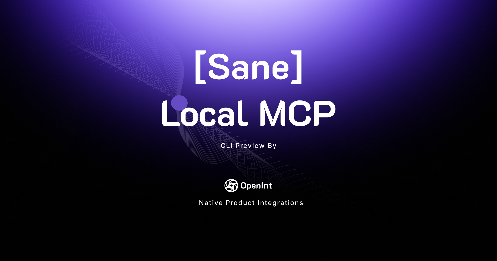
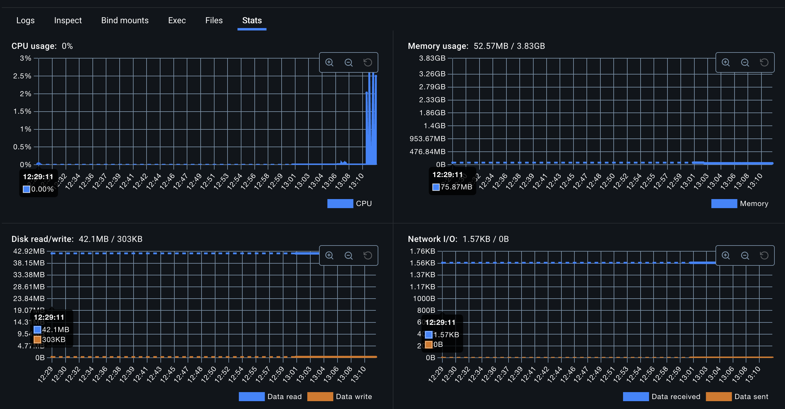
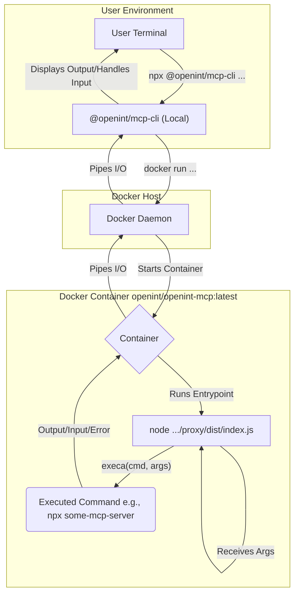

# Sane Local MCP (+ FREE startup idea!)



CLI to wrap any nodejs based STD/IO local Model Context Protocol (MCP) server in a thin docker container for improved monitoring and security

TLDR;

1. Local MCP isn't safe, but it doesn't need to be this way
2. We introduce a preview CLI that helps fix it (Sane Local MCP)

It helped up inform our research at [OpenInt](https://openint.dev) into MCP and the security challenges it poses. Here's our blog post about it: [https://blog.openint.dev/sane-local-mcp/](https://blog.openint.dev/sane-local-mcp/)

## 🛑 The Problem with Local STDIO MCP Servers

Local MCP servers using STDIO are inherently risky.

They operate with the same privileges as the host process, which means a malicious or misconfigured server can access sensitive files, execute arbitrary code, or exfiltrate data without proper isolation.

This lack of sandboxing poses significant security concerns, especially when integrating third-party MCP servers.

The [Damn Vulnerable MCP](https://github.com/openint-dev/damn-vulnerable-mcp) project published yesterday does a great job of detailing some of the vulnerabilities with it.

And NO, I don't happen to think that the solution of moving everything to cloud remote servers fixes everything (as is convenient for SaaS vendors that sell you hosted MCP servers).

## ✅ The Solution: Sane Local MCP (Alpha Preview ⚠️)

To address these security challenges, we've developed **Sane Local MCP**, a CLI tool that wraps any MCP server—whether from NPM into a Docker container.

This approach ensures that each server runs in an isolated environment, mitigating the risks associated with direct STDIO execution.

**Usage Examples:**

- Run an NPM-based MCP server

```bash
npx @openint/mcp-cli npx modelcontextprotocol/server-sequential-thinking
```

You can pass environment variables using the -e flag:

```bash
npx @openint/mcp-cli -e API_KEY=your_api_key npx @modelcontextprotocol/server-example
```

### 🧪 How to Use in Claude

To integrate with Claude Desktop, modify the claude_desktop_config.json file:​

```
{
  "mcpServers": {
    "filesystem": {
      "command": "npx",
      "args": ["@openint/mcp-cli", "npx", "modelcontextprotocol/server-sequential-thinking"]
    }
  }
}
```

This configuration ensures that the MCP server runs within a Docker container, providing a secure environment for Claude to interact with your local filesystem.​

### 🧪 How to Use in Cursor (with environment variables example)

For Cursor IDE, add the following to your MCP configuration:

```
{
  "mcpServers": {
    "sanity": {
      "command": "npx",
      "args": ["@openint/mcp-cli", "npx", "modelcontextprotocol/server-sequential-thinking"],
      "env": {
        "SANITY_PROJECT_ID": "your_project_id",
        "SANITY_DATASET": "production",
        "SANITY_API_TOKEN": "your_sanity_api_token"
      }
    }
  }
}
```

## Easy to monitor and manage

This enables you to monitor each of your running MCP servers within the Docker Desktop UI and get centralized logging and diagnostics on it.



## How to improve this (Free startup ideas!):

➡️ Support more than just NodeJS, perhaps with a different container image per CLI

➡️ On Linux, explore unikernels or Firecracker VM

➡️ On Mac containerize using the native container APIs

➡️ Have this work for also remote servers, perhaps create a single remote server proxy that works passthrough for remote and same API for STDIO based servers

➡️ Same CLI to work for running in the dev machine and also in the cloud for kubernetes with remote config

## Architecture

This workspace uses a client-server model where the CLI tool acts as the client and the Docker container running the proxy script acts as the server.

1.  **User/CLI:** The user initiates a command via `npx @openint/mcp-cli <cmd...>`. The `@openint/mcp-cli` package parses the command and arguments.
2.  **Docker Invocation:** The CLI constructs and executes a `docker run -i --rm openint/openint-mcp:latest <cmd...>` command, passing the user's command and arguments to the Docker daemon.
3.  **Container Startup:** Docker pulls (if needed) and starts the `openint/openint-mcp:latest` container.
4.  **Entrypoint Execution:** The container's entrypoint (`node /app/node_modules/@openint/mcp-proxy/dist/index.js`) is executed. The `<cmd...>` from the `docker run` command are passed as arguments to this Node.js script.
5.  **Proxy Logic:** The `@openint/mcp-proxy` script receives the command and its arguments. It uses the `execa` library to execute the command within the container's `/app` working directory.
6.  **I/O Piping:** The `stdio: 'inherit'` option in `execa` and the `-i` flag in `docker run` ensure that the standard input, output, and error streams of the executed command are piped back to the user's terminal where the CLI was initially invoked.



## Under the hood

This repository uses pnpm workspaces to manage the following packages:

- `@openint/mcp-cli`: The command-line interface installed via `npx`.
- `@openint/mcp-proxy`: The Node.js script that runs inside the Docker container to execute the target MCP command.
- `dockerfiles`: Contains the Dockerfiles for building the container images (though currently embedded within the CLI logic).

## License

MIT. Make a startup out of this!!!

## Why Do this?

[OpenInt](https://openint.dev) makes it a joy for developers to add integrations to their product. We see MCP as a client usage pattern and architecture that we have to support.We are focused on the developer experience of managing authentication for end-users, whether its in a traditional SaaS product or for agents. Hence we want to plug in to the rest of the ecosystem. This contribution to the ecosystem is our way of giving back.
